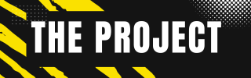

<h1 align="center">
   
  
   
  Team de décryptage AKI
   
</h1>

<h4 align="center">Équipe de décryptage initiée par M. Gillet composé de M. FOFANA, M. BARRY et M. ABADA.</h4>

  

  <a href="#le-projet">Le Projet</a> •
  <a href="#première-partie">La Première Partie</a> •
  <a href="#deuxième-partie">La Deuxième Partie</a> •
  <a href="#troisième-partie">La Troisième Partie</a> •
  <a href="#conclusion">Conclusion</a> •
  <a href="#license">License</a>

** **
## Le Projet

* Contexte
  - M. GILLET nous appelle une deuxième fois suite à notre merveilleuse réussite avec la première mission qu'il nous a attribué.
  - Alice et Bob, deux tourtereaux qui s'aiment passionnément, vivent un amour secret depuis des années. Comment arrivent-t-ils à garder ce secret ? L'échang de message chiffrés. Ils utilisent un protocole se nommant PlutotBonneConfidentialité dont il peut être résumer ainsi : 
    - A l’aide d’un protocole cryptographique asymétrique, ils s’échangent une clé de session. Cette clé servira à
    chiffrer les communications futures.
    - Une fois cette clé choisie et échangée, le chiffrement des messages s’opère grâce à un protocole cryptographique
    symétrique. Ils peuvent ainsi communiquer en toute liberté !
  
  - Eve, la meilleure amie d'Alice, souhaite réveler au grand jour leur histoire et veut donc déchiffrer leur communication.
* Notre employeur nous a donc aider en structurant 4 parties. La première est un peu pour tâter le terrain, comprendre le sujet. La deuxième est le développement d'un protocol expérimental permettant de mettre en évidence la différence de sécurité entre les deux
protocoles AES et RSA. La troisième est l'analyse des messages envoyés par Alice et Bob. Enfin, la dernière et quatrième partie, concerne la réponse à plusieurs questions afin d'aller plus loin dans le travail.

## Première partie

## Deuxième partie

## Troisième partie

## Quatrième partie

## Conclusion

## Credits

Nous tenons à remercier tous le personnel de l'IUT d'Orléans pour leur soutien et leur aide dans ce projet. Nous tenons aussi à remercier M. GILLET pour nous avoir confié ce projet, ce qui nous a permis de nous améliorer dans le domaine de la cryptographie. De plus, cela signifie que notre employeur [M. GILLET](noel.gillet@univ-orleans.fr) a confiance en nous et nous le remercions pour cela. 

## License

M. GILLET, M. FOFANA, M. BARRY et M. ABADA -
AKI Team - IUT d'Orléans

(<a href="#le-projet">back to top</a>)

